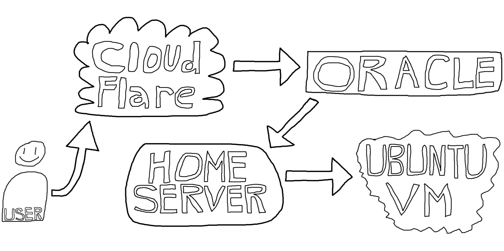

In this post, I’ll share why I chose to self-host my site and how I set it up. This isn’t a step-by-step guide, but feel free to reach out if you're exploring something similar.

## Why Self-Host?
My journey into self-hosting started because I already had a home server running various applications since early 2025. While I was comfortable with private services accessed via VPN, making something publicly accessible was new territory for me. I wanted to learn how to open up my site to the world, and self-hosting gave me the flexibility and control I was looking for.

With self-hosting, I can manage every aspect of my site, from the software stack to the hardware. If I ever want to switch from a static site to something dynamic, I can do so without restrictions from a cloud provider. Also, I’m not expecting heavy traffic, so I don’t need the resources or scalability that big cloud platforms offer.

### Should You Self-Host?
Self-hosting isn’t for everyone. If you already have the hardware and enjoy tinkering with servers and networking, it can be a rewarding experience. However, using a cloud provider is much simpler and avoids many of the headaches that come with managing your own infrastructure. My setup isn’t designed for lots of concurrent users, and scaling for a large audience would be challenging. Security is also a major concern, and you need to be diligent about how you configure your server.

### How I Self-Host
Here’s a quick overview of my setup:
- **Domain registration:** Cloudflare
- **Public IP address:** Oracle VPS (Virtual Private Server)
- **Website hosting:** Home server for static files
- **Secure connection:** WireGuard tunnel between VPS and home server
- **Traffic management:** Nginx

I won’t go into all the technical details here, but I plan to write more about my home server setup soon.

##### Why Use a VPS?
My internet provider uses CGNAT (Carrier-Grade NAT), which means I don’t get a public IP address at my apartment. To work around this, I use a VPS. I chose to go with Oracle’s free tier, which doesn’t expire as long as you stay within certain limits. Other providers like AWS offer free VPS options, but those are usually time-limited. While relying on a VPS isn’t pure self-hosting, I keep all my data on my home server and use the VPS only for its public IP.

I’ll share more details about my home server setup in a future post. If you have questions or want to try self-hosting yourself, feel free to reach out!